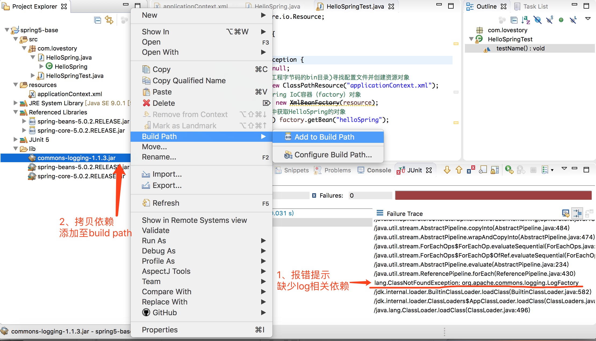

## 一 IoC
### 1. IoC概述
> 什么是IoC？

IoC（Inversion of Control，控制反转），是指将原来在程序里面手动创建对象操作的控制权移交给Spring框架去管理。   
其实，**IoC是一种设计思想，而非一种技术。**。
> 主动控制  

调用者自己对将要使用的对象以及该对象的依赖对象进行创建和组装。如图所示：

> 反转控制

调用者无需关心对象的创建过程、该对象的依赖对象的创建以及他们的组装，而是将这些操作的控制权交给了Spring框架，调用者只需要从Spring框架中获取相关对象。如图所示：

### 2. DI概述
> 什么是DI？

DI（Dependency Injection，依赖注入），指在Spring创建对象的过程中，将其所依赖的属性（常量、对象或集合等）配置到该对象中。
> IoC与DI的区别与联系

IoC是指将创建对象的控制权转交给Spring容器，DI不仅强调了对象由Spring容器来创建，并且强调了对象之间的依赖关系。
DI更明确的说明了“被注入的对象（例如UserService）依赖IoC容器对其依赖的对象（UserDao）进行配置”。
## 二 程序演练
### 1. 依赖jar包
jar包下载：在[spring官网](http://repo.springsource.org/libs-release-local/org/springframework/spring/5.0.2.RELEASE/)中选择相应版本下载。  
### 2. 创建工程（IDE：STS）
1. 新建java project，创建lib目录并导入Spring5的核心jar包，将jar包添加到build path。如图所示：

2. 新建source folder类型的resources目录用来存放配置文件，创建applicationContext.xml文件并配置schema约束（STS可以直接创建spring使用的文件形式）。如图所示：

如果没有使用STS开发工具，则需要自行创建一个名为apllicationContext.xml文件，并配置schema约束，约束可以通过下载的spring包中的docs目录中间接查看，路径如图：

然后在网页中搜索"<beans"关键字，将查询到的内容复制到xml文件中即可，如图所示：

3. 新建HelloSpring类和HelloSpringTest测试类：
HelloSpring类如图：

测试类使用JUnit5，如果报错，解决方式如图所示：

4. 配置applicationContext.xml

5. 运行测试类会发现报错，查看原因是由于缺少logging依赖包，则需要下载commons-logging的jar包，拷贝到lib下并添加到build path。

6. 前述问题解决后，测试通过

## 三 程序分析
### 1. 什么是BeanFactory
BeanFactory表示Spring IoC容器，是生产bean对象的工厂，负责配置、创建和管理bean的生命周期，是Spring最古老的接口。  
Spring IoC容器所管理的对象就称为bean。
### 2. Spring IoC容器如何知道哪些是它所管理的对象
Spring IoC通过读取配置文件中所配置的元数据，通过元数据对应用中的各个对象进行实例化及装配。
> 三种元数据的配置方式
1. XML-based configuration
2. Annotation-based configuration
3. Java-based configuration
### 3. Spring IoC管理bean的原理
1. 通过Resource对象加载配置文件
2. 解析配置文件，得到指定名称的bean
3. 解析bean元素，id作为bean的名字，class用于反射得到bean的实例。其中，**bean类必须存在一个无参构造器（和访问权限无关）**
4. 调用getBean()方法的时候，从容器中返回对象实例

其实，就是把代码从java文件转移到了xml文件中。
## 四 getbean()方法的三种签名
getBean()方法是用来从Spring IoC容器中获取bean的对象
### 1. Object getBean(String beanName)
签名一：根据bean对象在容器中的名称来获取
factory.getBean("helloSpring");
一般不会出现相同的bean name，xml中的id值需唯一，否则会报BeanDefinitionParsingException错误
### 2. T getBean(Class<T> requireType)
签名二：根据指定的类型去寻找bean的对象
factory.getBean(HelloSpring.class);
一般xml中不会对不同的bean配置同一个类型，否则会报NoUniqueBeanDefinitionException错误
### 3. T getBean(String beanName, @Nullable Class<T> requireType)
签名三：根据bean对象的类型和id名称去寻找，**强烈推荐使用该方式**
factory.getBean("helloSpring", HelloSpring.class);
## 五 Spring基本配置
### 1. bean元素
> id和name属性

Spring的配置中，id和name都可以定义bean元素的名称。  
id属性遵守xml语法ID的约束，必须以字母开始，可以使用字母、数字、下划线、冒号等，不能以"/"开头。  
name属性可以使用很多特殊字符，也可以为bean元素起多个别名，多个别名之间使用逗号或者空格隔开，使用其中一个通过调用getBean()方法就可以。  
`<bean name="love,lovely" class="...">` 或者 `<bean name="love lovely" class="...">`

**注意1：从Spring3.1开始，id属性不再是ID类型了，而是String类型，也可以使用“/”开头了。**  
**注意2：bean应该尽量规范其名，不要使用非主流名称，尽量使用id。**
### 2. \<import resource="/"\>元素
开发中，应用规模增加会导致xml中的bean元素配置数量增大，通过将xml分解，可以提高可维护性。  
在applicationContext.xml文件的beans元素内，可以通过import元素导入其他的配置文件（默认从bin目录开始）。  
语法：`<import resource="src/com/lovestory/hellospring.xml">`  
说明：  
1. 默认情况是从classpath的根路径查找
2. 可以使用前缀来定义文件的基础位置（**推荐这种写法**）
`<import resource="classpath:src/com/lovestory/hellospring.xml">`   

**注意：只有当框架中实现了Resource接口才能识别前缀标识符classpath。**

## 六 测试框架
### 1. 传统测试与Spring测试框架
传统测试，如JUnit4、JUnit5等单元测试，一方面，每次运行测试案例都会创建和销毁一个新的Spring IoC容器，性能不好。另一方面，销毁Spring IoC容器属于非正常方式强制关闭，使得扫尾工作执行不到。如图所示：

Spring测试框架是由Spring IoC容器管理测试代码。如图所示：

### 2. Spring测试框架
> 测试依赖

导入如下jar包，并添加到build path中  
spring-test-版本.jar  
spring-context-版本.jar  
spring-aop-版本.jar  
spring-expression-版本.jar  
> 基于JUnit4

> 基于JUnit5

## 附录
### 1. Spring配置文件说明
1. 必须要有schema声明，约束和规范我们的配置如何去写，约束指向的网络路径。
2. 开发xml时，如果联网会自动缓存路径文件到本地，提供提示功能。
3. 如果没联网，需要配置xsd schema文件位置：
先拷贝图片中红色框内的内容

然后按下图进行操作即可完成：

其中，文件系统路径是spring包的schema目录中，具体路径如下图：


